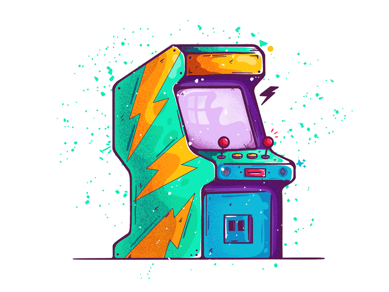

  

<h1 align="center">Keyboard-hero</h1>

 

## 🤖 Challenge

Esse projeto foi realizado no [Challenge da FW7](https://github.com/fw7-solucoes/challenges/tree/master/challenge-11), um desafio com o propósito de estudo e gerar engajamento com a comunidade de desenvolvimento.

 

## 🛸 Sobre

Nesse desafio vamos estar realizando um __mini game__ que vai ser bem maneiro, será o seguinte jogo. Será feito uma interface que exibirá uma letra aleatória de **A~Z** para o usuário, o usuário deve pressionar as letra exibida em seu teclado, e caso for igual, deve ser contabilizado um **acerto**, caso contrário, contabilizar um **erro**,

### Objetivos do challenge: 

- Deve ser gerado uma letra aleatória e apresentar para o usuário.
- Deve haver um contador decrescente de 60 segundos.
- Deve apresentar os acertos e erros.
- Deve considerar cada evento no teclado para contabilizar os acertos e erros.
- Deve ser gerado uma nova letra sempre que o usuário acertar.

 

## 🛰 Tecnologias e ferramentas utilizadas

- Typescript
- React
- Styled components
- Semantic ui
- Netlify

 

👾 Da uma conferida lá no <a href="https://keyboard-hero-react.netlify.app/">Preview</a>

Valeus 🖖
